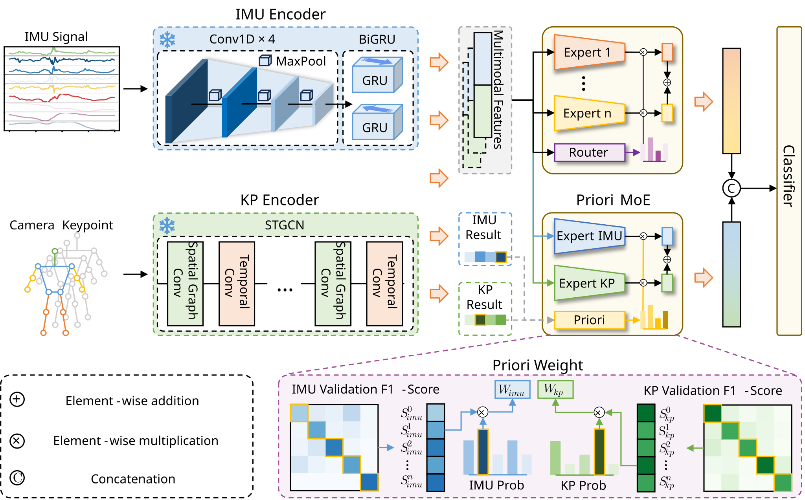

# RAMoE

Official code for **RAMoE: Reliability-Aware Multimodal Fusion for Automated Safety Monitoring of Scaffold Operations Using IMU and Skeleton Keypoints**.

RAMoE is a PyTorch framework for scaffold unsafe behavior recognition from paired inertial measurement unit (IMU) signals and vision-derived skeleton keypoints (KP). The model uses a dual mixture-of-experts design: a **Prior MoE** branch models class-wise modality reliability, and an **Adaptive Sparse MoE** branch routes fused multimodal representations to sample-specific experts.

## Architecture



The framework contains five main components: an IMU temporal encoder, a KP spatio-temporal graph encoder, a Prior MoE branch, an Adaptive Sparse MoE branch, and a final classifier.

## Project Structure

```text
RAMoE/
├── data_provider/          # SWIT data preprocessing and dataset generation
├── model/
│   ├── unimodal/           # IMU TemporalConv-BiGRU and KP ST-GCN encoders
│   ├── multimodal/         # RAMoE and multimodal fusion baselines
│   └── ablation/           # Ablation variants of RAMoE
├── multimodal/
│   ├── train/              # Training scripts
│   ├── evaluate/           # Evaluation, perturbation, and analysis scripts
│   └── run.py              # Example evaluation entry point
├── util/                   # Data loading, augmentation, and evaluation utilities
├── config.py               # Logging configuration
└── pyproject.toml          # Python dependencies
```

## Installation

This project uses Python `>=3.13` and PyTorch. Dependencies are listed in `pyproject.toml`.

```bash
uv sync
```

or install manually:

```bash
pip install -e .
```

The PyTorch CUDA package index is configured in `pyproject.toml`.

## Data Preparation

The dataset files are not included in this repository. The training scripts expect processed tensors under `dataset/`.

To generate per-user tensors from the SWIT raw data, adjust the dataset paths in `data_provider/gendata.py`, then run:

```bash
python -m data_provider.gendata
```

The processed files follow this format:

```text
dataset/
├── user_1.pt
├── user_2.pt
└── ...
```

Some training and evaluation scripts also load cached split files such as:

```text
dataset/dataset.pt
dataset/dataset_ag.pt
```

## Training and Evaluation

Train RAMoE:

```bash
python -m multimodal.train.moe_drop
```

Evaluate a saved RAMoE checkpoint:

```bash
python -m multimodal.run
```

Other scripts are provided for related experiments:

```text
multimodal/train/base.py              # Simple multimodal baseline
multimodal/train/moe.py               # MoE training entry point
multimodal/train/moddrop.py           # Modality-dropout baseline
multimodal/train/pretrained.py        # Pretrained encoder baseline
multimodal/evaluate/unimodal.py       # Unimodal evaluation
multimodal/evaluate/data_perturbation.py
multimodal/evaluate/adaptive_router_mechanism.py
```

Before running, update script-level settings such as `device`, checkpoint names, and dataset filenames to match your local environment.

## Citation

```bibtex
@article{ramoe2026,
  title   = {RAMoE: Reliability-Aware Multimodal Fusion for Automated Safety Monitoring of Scaffold Operations Using IMU and Skeleton Keypoints},
  author  = {Li, Wenhao and Zhu, Liujinxiang and Bao, Yihang and Liu, Tianqi and Su, Hechong and Chang, Shi and Lin, Guan Ning},
  year    = {2026}
}
```
